# Grim Fronteira - Marshal Tutorial

Real screenshots from a local production build. Game app source files were not changed.

**Branch:** feature/post-deploy-polish
**Commit:** d2592b2731ba0919ed7dd2950be64947bc17e349
**Captured:** 5 October 2026
**Capture size:** 1280 x 720 CSS pixels (browser default).

## Reading order

### 01. Create your game

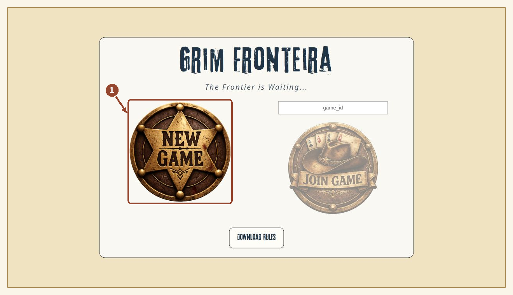

Click New Game (1). You become the Marshal of a new game.

### 02. Invite your players

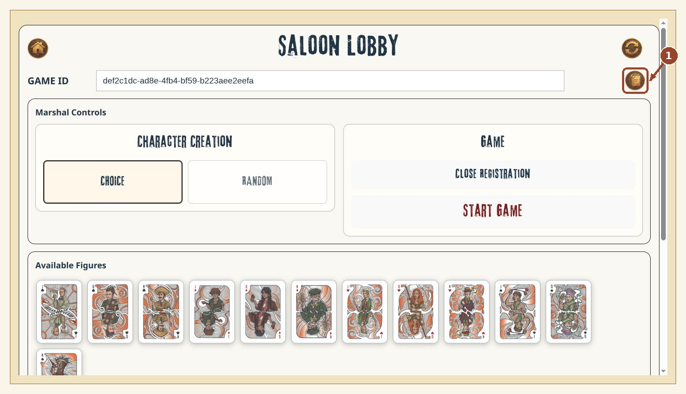

Click Copy Game ID (1), then send the copied ID to your friends. Each friend uses it to join from their own browser.

### 03. Choose character assignment

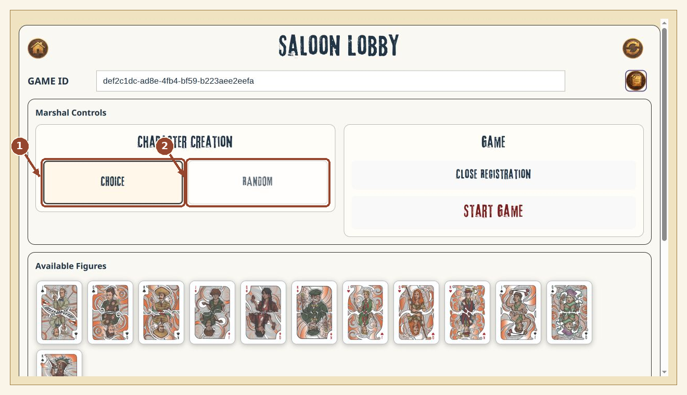

Keep CHOICE (1) so players pick their own figure, or select RANDOM (2) to assign figures randomly. This guide uses CHOICE.

### 04. Start when everyone is ready

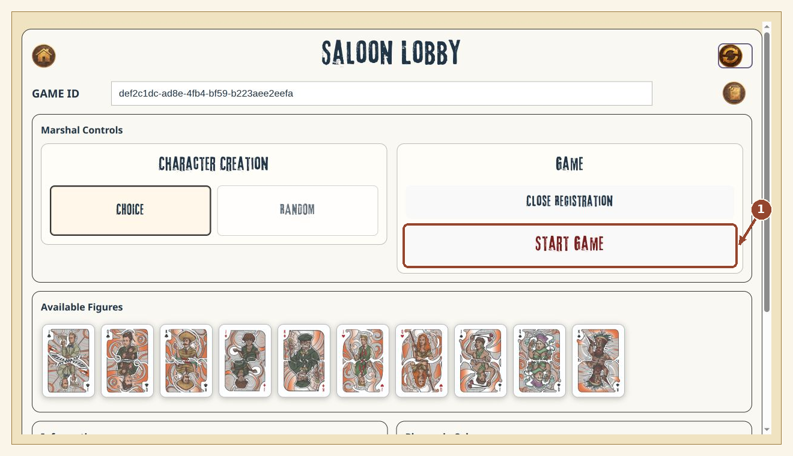

Once at least one player has joined and every joined player has chosen a figure, name, and feature, click Start Game (1). Players become ready automatically when their character is complete.

### 05. Choose the opening story

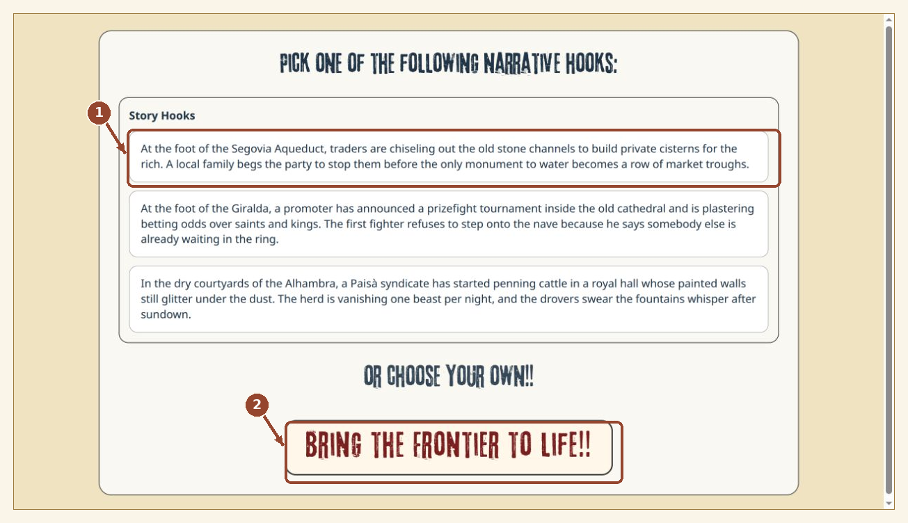

Choose a suggested narrative hook, such as the highlighted Story Hook (1), or prepare your own. Then click Bring the Frontier to life!! (2) to move to the game table.

### 06. Choose who is in the scene

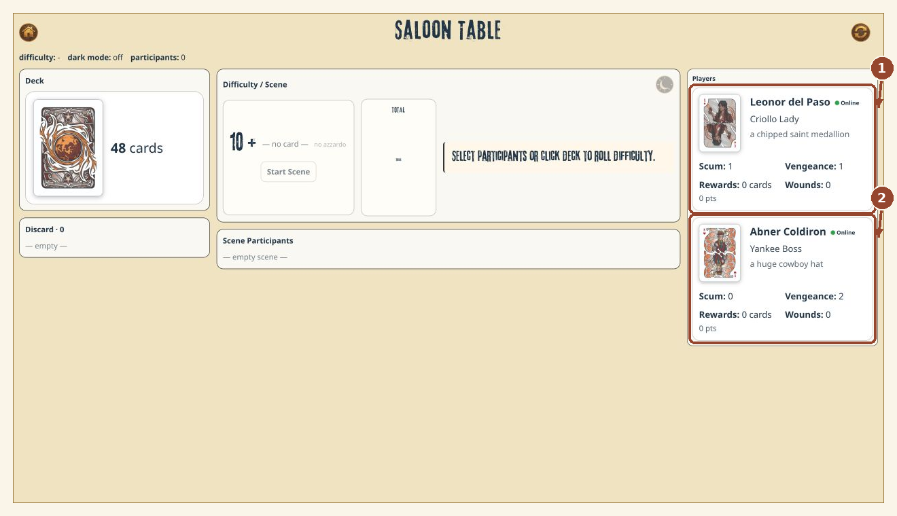

Click Leonor del Paso’s player panel (1) and Abner Coldiron’s player panel (2) to include both in this challenge. Selected characters appear in Scene Participants. Leave other players outside the scene.

### 07. Set the challenge

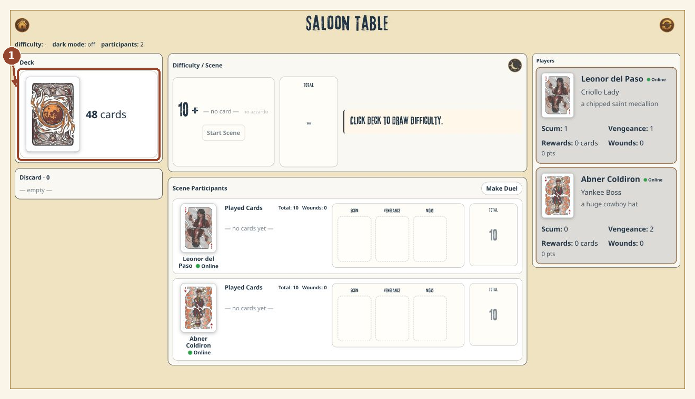

For this ordinary scene, leave the Dark off and click the deck (1) once to draw the difficulty. Players must match or exceed it without busting.

### 08. Deal the first hands

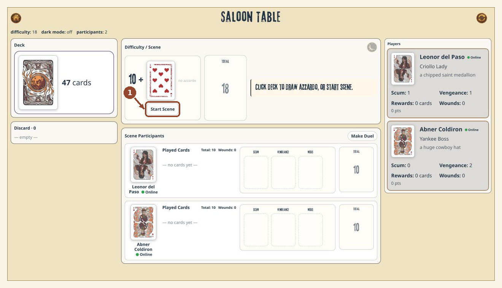

The difficulty is set. Click Start Scene (1) to deal one card to each participant. For this introductory scene, skip the optional Azzardo.

### 09. Follow the player turns

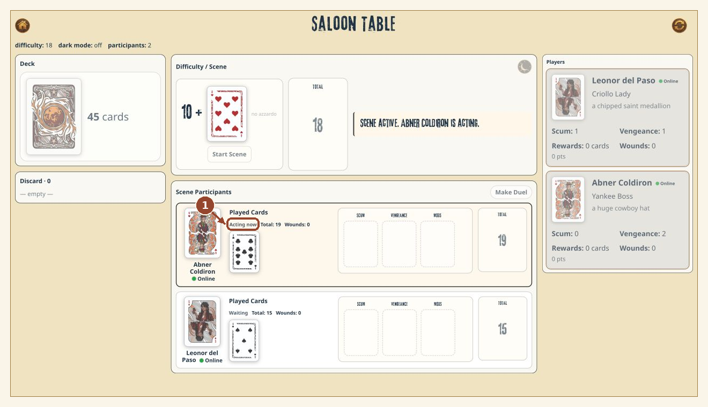

The highest initial hand acts first. The Acting now label (1) identifies the current player—in this screenshot, Abner Coldiron. Follow each total while players draw, Stay, and use their resources. Let each player control their own hand.

### 10. Review results and wait

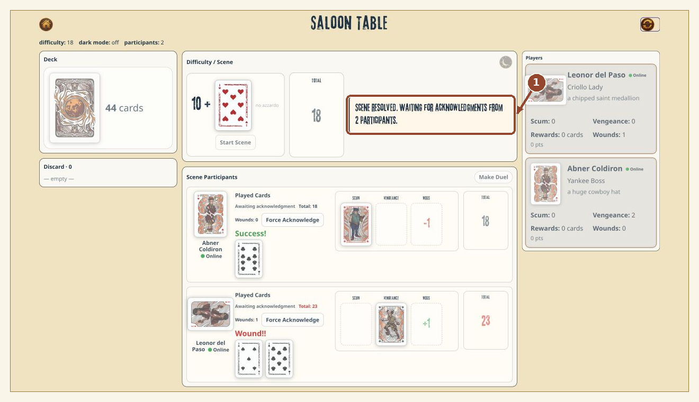

The status message (1) says the scene is resolved and is waiting for acknowledgments from 2 participants. Players may still react before acknowledging. Wait for their acknowledgments; Force Acknowledge is an emergency control.

### 11. Close the completed scene

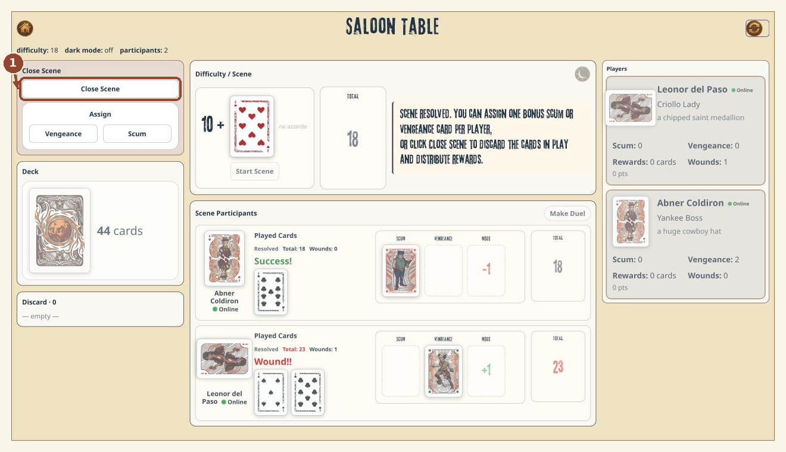

Once acknowledgments are complete, click Close Scene (1). This deals earned Rewards and clears the played cards. Optional bonus Scum or Vengeance can be assigned before closing.

### 12. Prepare the next scene

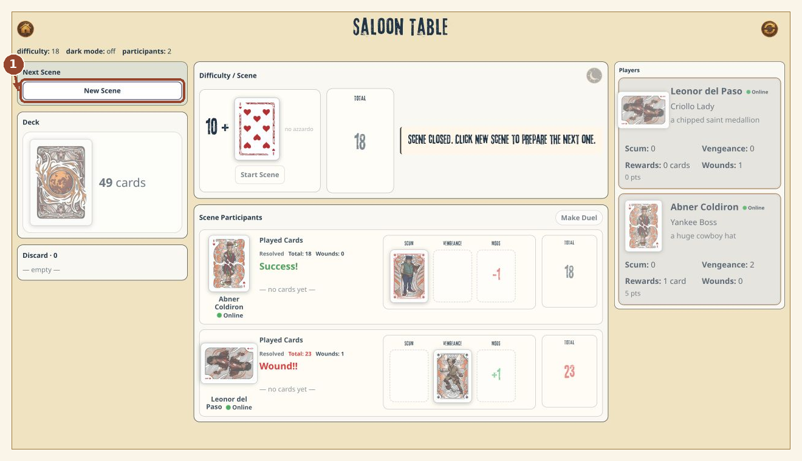

Click New Scene (1) in the Next Scene panel. If it is blocked, wait for required healing choices or Reward discards to finish, then continue with the next challenge.

## Editing and regeneration

Edit the corresponding record in ../captures.json and run ../render_annotations.py with Python 3 and Pillow. The script regenerates PNGs, editable self-contained SVGs, steps.json, and this reading-order guide. Original screenshots remain unchanged.
Use --metadata-only to update steps.json and this README without modifying any images. Numbered markers follow the marks array order, starting at 1. Titles and captions stay outside the PNGs and SVGs.

## Scope and verified flow

Verified through an ordinary two-player scene, player acknowledgments, Close Scene, Reward distribution, and New Scene. The UI automatically marks a character ready after name and feature selection.

Healing, excess-Reward discards, detailed Azzardo and Dark play, and the other faction powers are not illustrated as separate walkthroughs. They are advanced follow-ups. The final Player screenshot shows the successful second player (Abner), while most earlier Player screenshots follow Leonor. The faction screenshot is an optional example: its selection was cancelled before ordinary play continued.

These are local disposable sample games. No invitations were sent, no source files were changed, and nothing was committed or deployed.