# Grim Fronteira - Player Tutorial

Real screenshots from a local production build. Game app source files were not changed.

**Branch:** feature/post-deploy-polish
**Commit:** d2592b2731ba0919ed7dd2950be64947bc17e349
**Captured:** 5 October 2026
**Capture size:** 1280 x 720 CSS pixels (browser default).

## Reading order

### 01. Join your friends

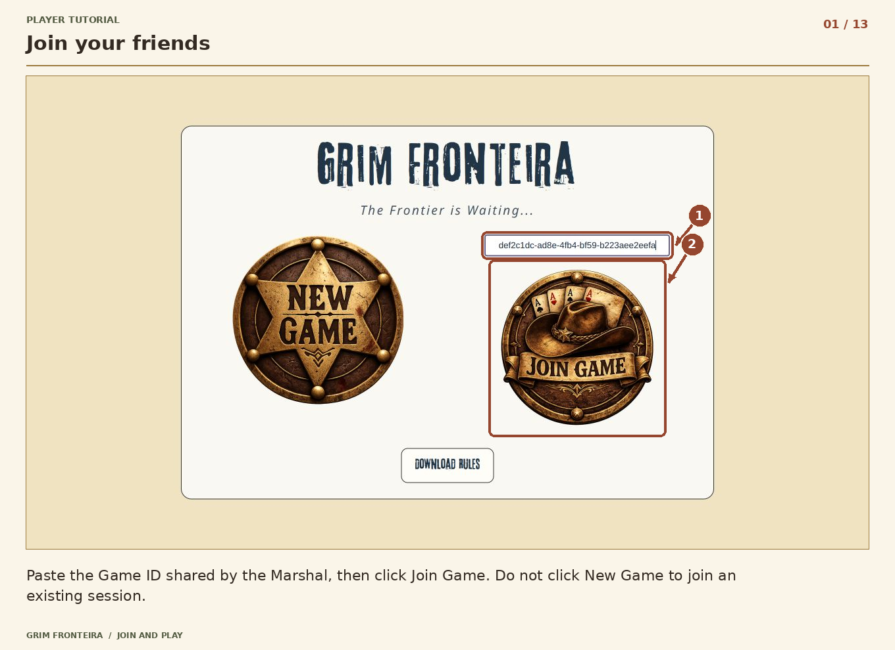

Paste the Game ID shared by the Marshal, then click Join Game. Do not click New Game to join an existing session.

### 02. Choose your figure

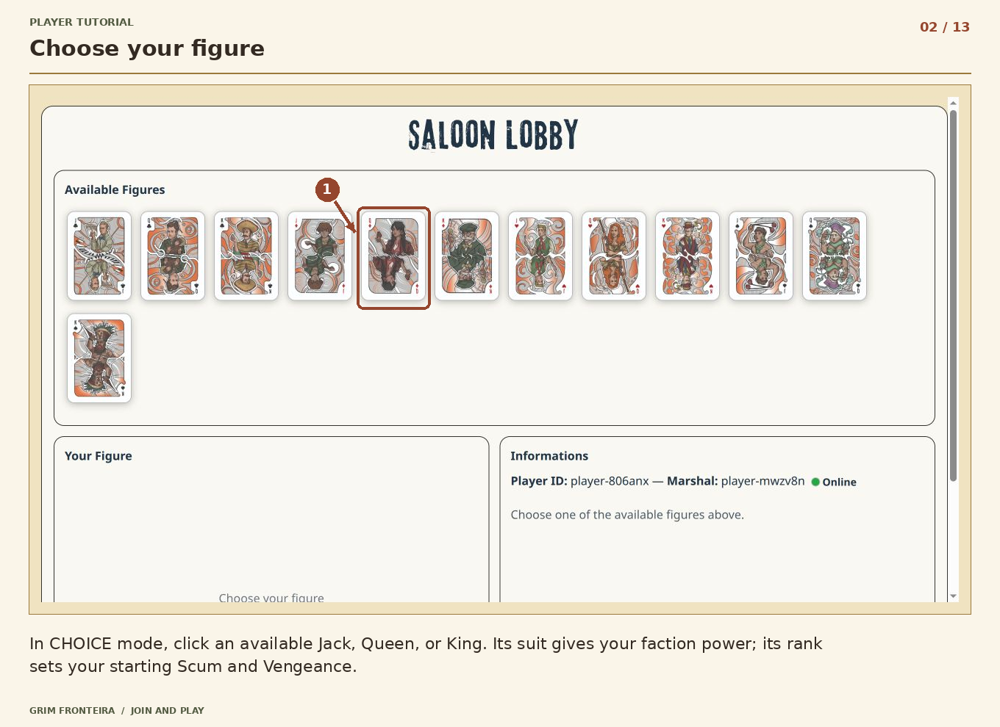

In CHOICE mode, click an available Jack, Queen, or King. Its suit gives your faction power; its rank sets your starting Scum and Vengeance.

### 03. Name your character

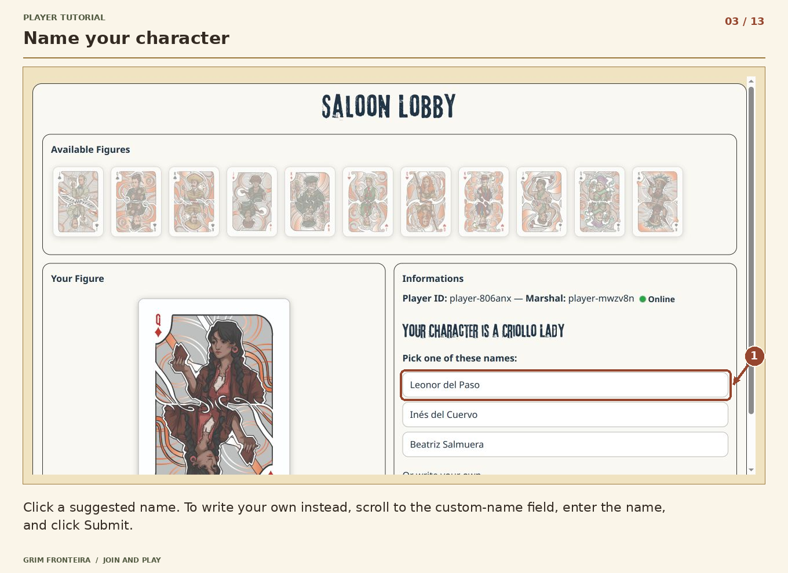

Click a suggested name. To write your own instead, scroll to the custom-name field, enter the name, and click Submit.

### 04. Give your character a feature

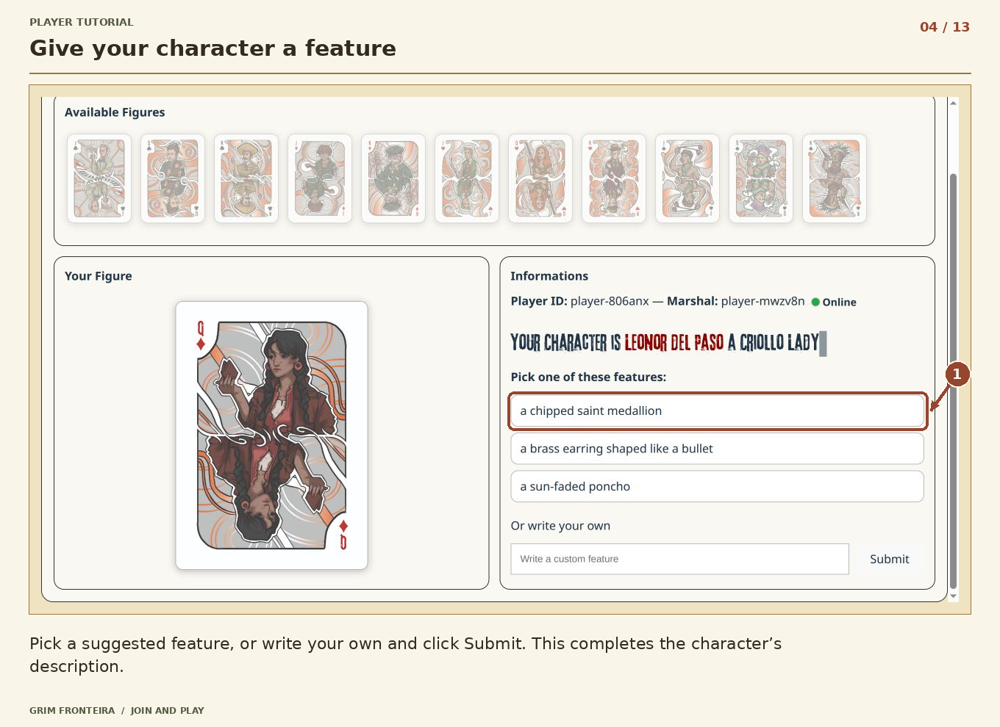

Pick a suggested feature, or write your own and click Submit. This completes the character’s description.

### 05. Your character is ready

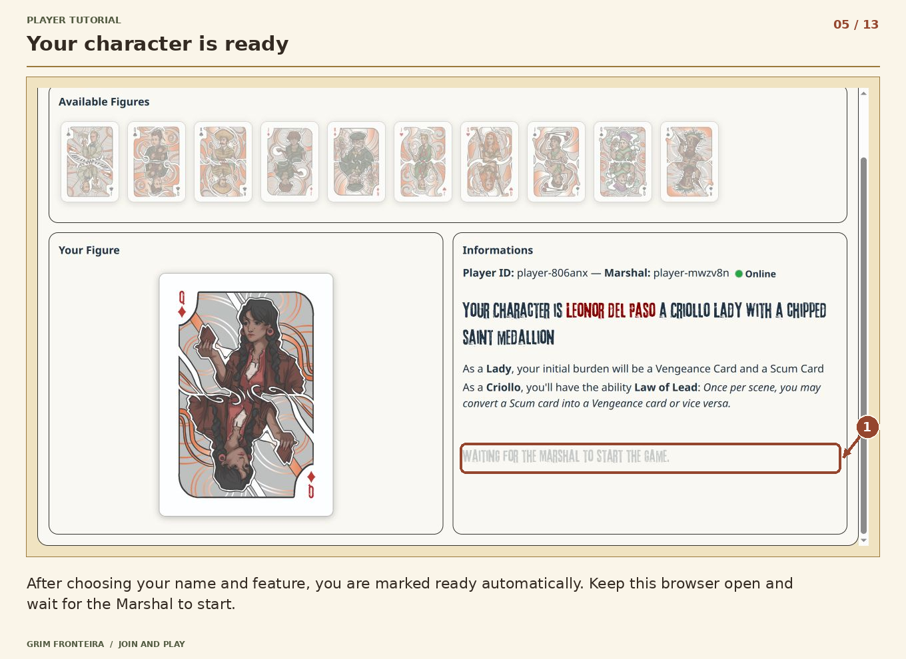

After choosing your name and feature, you are marked ready automatically. Keep this browser open and wait for the Marshal to start.

### 06. Read your character board

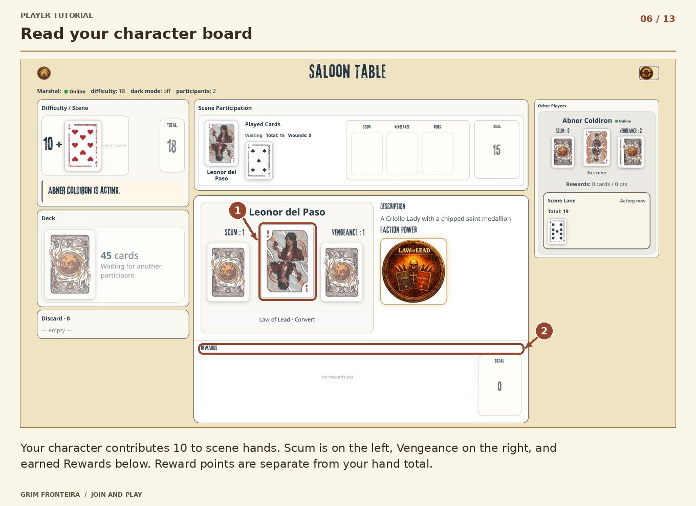

Your character contributes 10 to scene hands. Scum is on the left, Vengeance on the right, and earned Rewards below. Reward points are separate from your hand total.

### 07. Wait for your turn

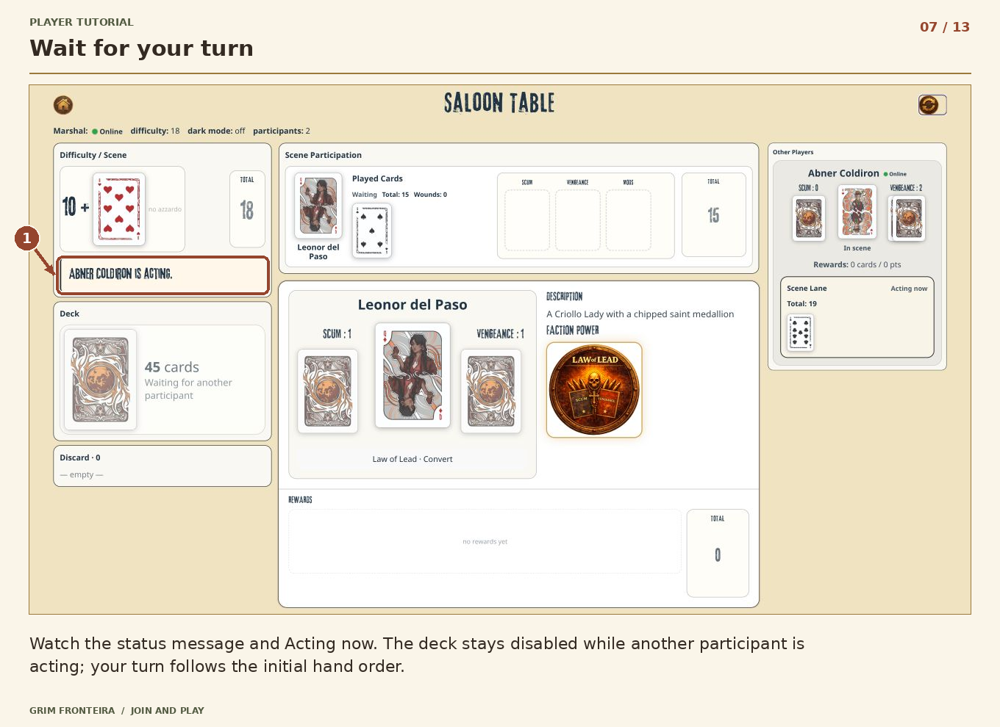

Watch the status message and Acting now. The deck stays disabled while another participant is acting; your turn follows the initial hand order.

### 08. Draw or Stay

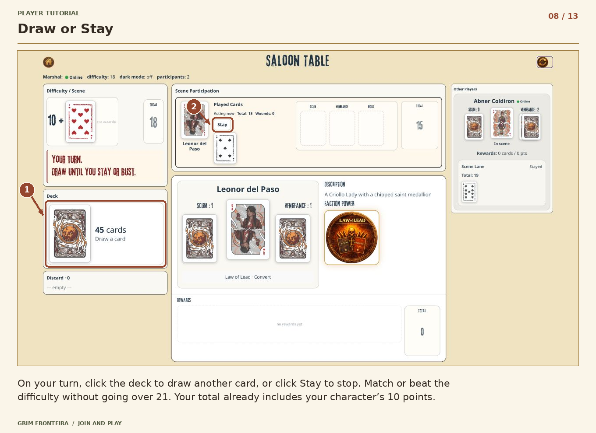

On your turn, click the deck to draw another card, or click Stay to stop. Match or beat the difficulty without going over 21. Your total already includes your character’s 10 points.

### 09. Boost your hand with Vengeance

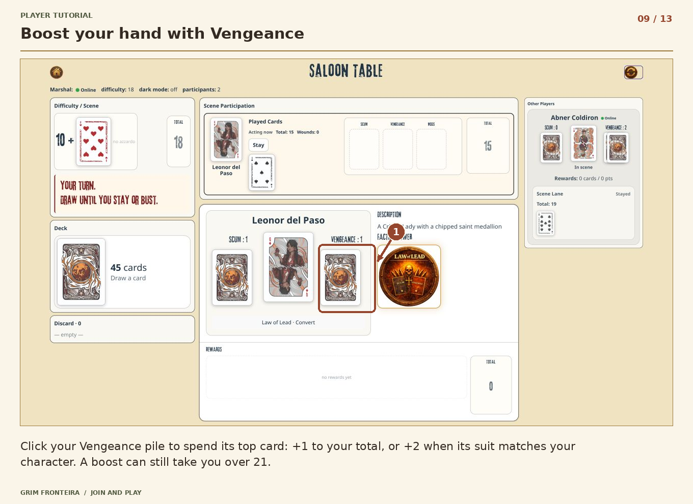

Click your Vengeance pile to spend its top card: +1 to your total, or +2 when its suit matches your character. A boost can still take you over 21.

### 10. Optional: use your faction power

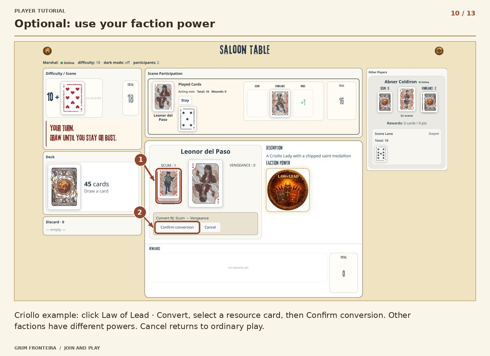

Criollo example: click Law of Lead · Convert, select a resource card, then Confirm conversion. Other factions have different powers. Cancel returns to ordinary play.

### 11. Optional: target another player

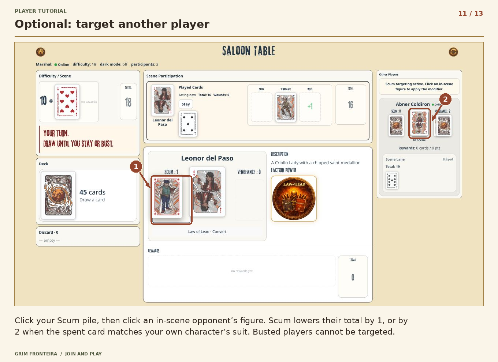

Click your Scum pile, then click an in-scene opponent’s figure. Scum lowers their total by 1, or by 2 when the spent card matches your own character’s suit. Busted players cannot be targeted.

### 12. Confirm the scene result

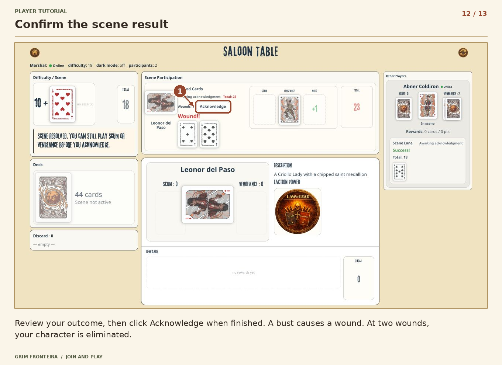

Review your outcome, then click Acknowledge when finished. A bust causes a wound. At two wounds, your character is eliminated.

### 13. Collect Rewards and continue

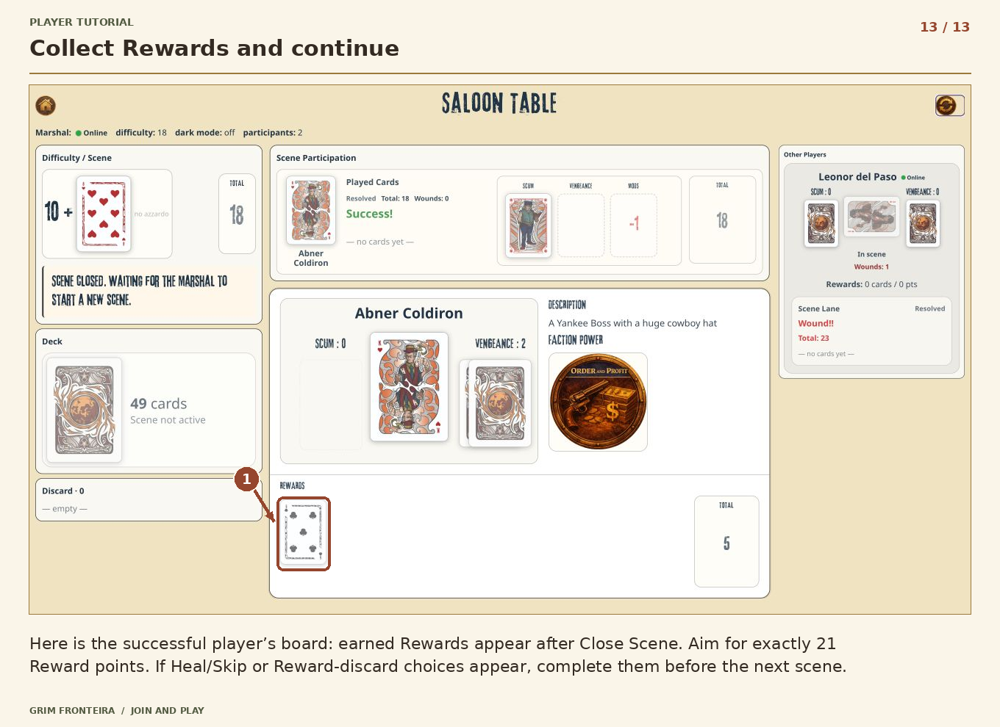

Here is the successful player’s board: earned Rewards appear after Close Scene. Aim for exactly 21 Reward points. If Heal/Skip or Reward-discard choices appear, complete them before the next scene.

## Editing and regeneration

Edit the corresponding record in ../captures.json and run ../render_annotations.py with Python 3 and Pillow. The script regenerates PNGs, editable self-contained SVGs, steps.json, and this reading-order guide. Original screenshots remain unchanged.

## Scope and verified flow

Verified through an ordinary two-player scene, player acknowledgments, Close Scene, Reward distribution, and New Scene. The UI automatically marks a character ready after name and feature selection.

Healing, excess-Reward discards, detailed Azzardo and Dark play, and the other faction powers are not illustrated as separate walkthroughs. They are advanced follow-ups. The final Player screenshot shows the successful second player (Abner), while most earlier Player screenshots follow Leonor. The faction screenshot is an optional example: its selection was cancelled before ordinary play continued.

These are local disposable sample games. No invitations were sent, no source files were changed, and nothing was committed or deployed.